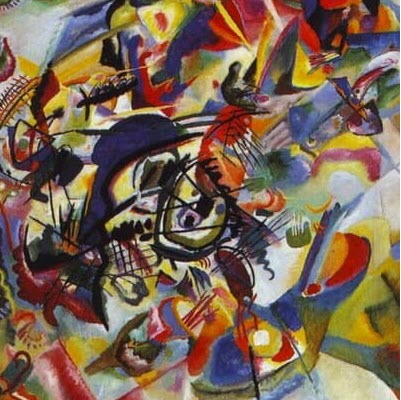

# tg-bot-style
This bot performs style transfer using either [Neural Style Transfer](https://arxiv.org/abs/1508.06576) or [CycleGan](https://arxiv.org/abs/1703.10593) techniques. 

**Neural Style Transfer (NST)** algorithm receives two images as input. One of them is considered as "content" which should be modified while the other is treated as "style" which should be applied to "content". The algorithm learns on the fly for each new content-style pair, so it is relatively slow although has a high flexibility. In order to reduce execution time the size of the output image is set to 128 by 128 pixels. NST module is taken from official [Pytorch manual](https://pytorch.org/tutorials/advanced/neural_style_tutorial.html) with minor changes. It is located in [NST](nst) folder.

**CycleGan** transforms summer landscapes into winter ones. The pretrained network is taken from the [official repository](https://github.com/junyanz/pytorch-CycleGAN-and-pix2pix). The network was trained on Yosemite National Park images so the model should work best with similar images.  

**Telegram bot** is written using [AIOGram](https://github.com/aiogram/aiogram) asynchronous framework. It is located in [bot](bot) folder. You should change paths in [config](bot/config.py) file in order to run it on your system. Do not forget to add your Telegram token as well. Main entry point for bot initialization is [main.py](main.py) file. Bot name is @style_transfer354_bot. 

